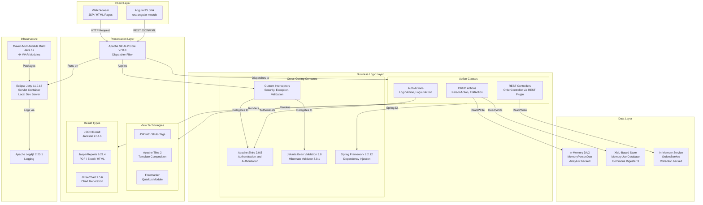

# Architecture Diagram

This Apache Struts 2 multi-module Maven project is a collection of 44 web application examples, each packaged as a WAR and deployed on a Jakarta EE 10 Servlet container.

## Application Architecture

