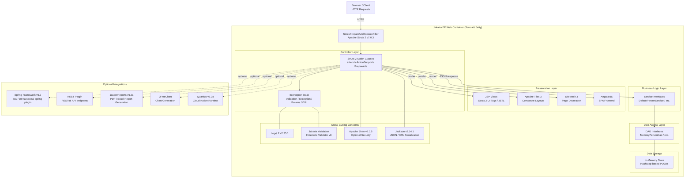

# Architecture Diagram

This diagram represents the high-level architecture of the Apache Struts 2 multi-module web application, covering its MVC layers, key frameworks, data storage, and optional integrations.

## Application Architecture

